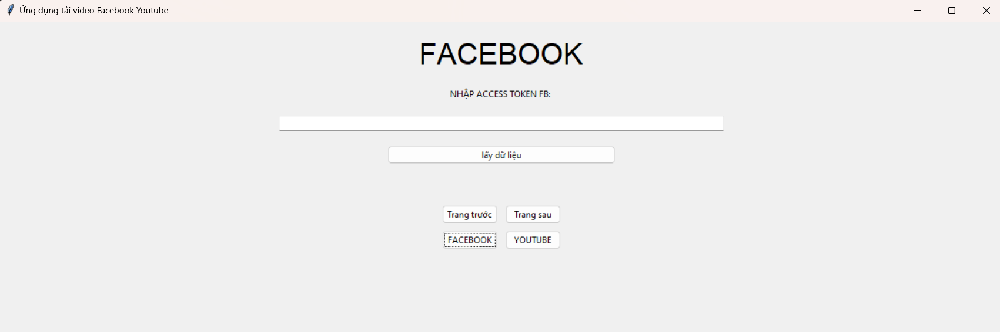
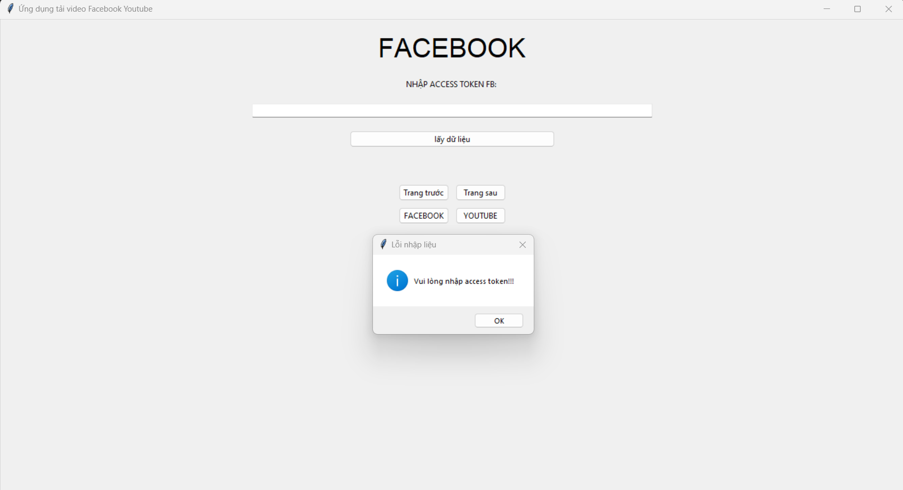
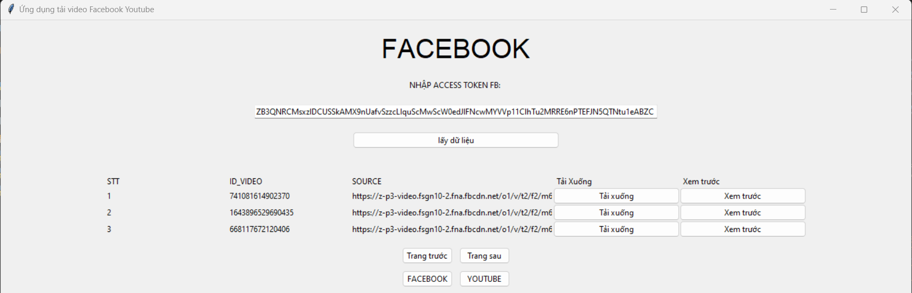
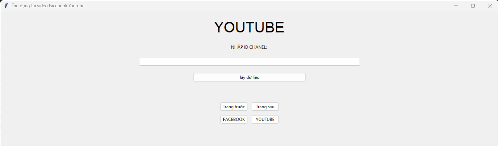
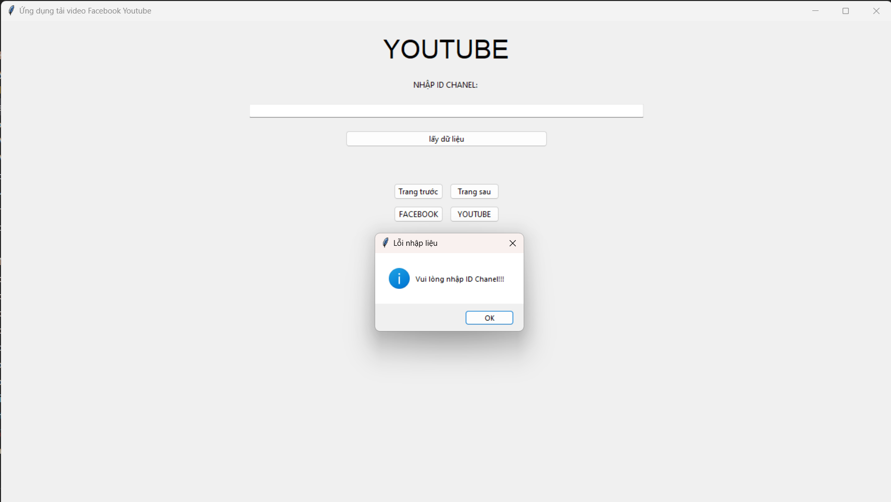
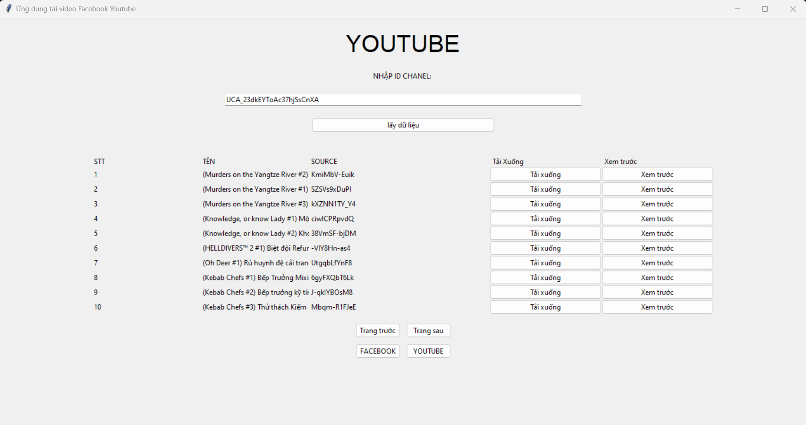

# Giới thiệu
Đây là 1 dự án cá nhân về ứng dụng tại video trên facebook và youtube.Trong ứng dụng người dùng sẽ có 2 lựa chọn cho người dùng tùy biến chọn để tải video từ page của mình từ facebook hoặc các video từ 1 chanel.Ứng dụng sử dụng API miễn phí của Youtube và Facebook để thực hiện các thao tác. Để tìm hiểu rõ về ứng dụng hơn ta có thể xem tại [đây](3120410270_NguyenMinhKiet_Facebook_Youtube_Downloader).
# Cài đặt
* git clone https://github.com/NguyenMinhKiet/Facebook_Youtube_Downloader
* Phiên bản python: 3.7.9

## Thư viện
* requests            
* json                
* pytube              
* webbrower           
* urllib.request      
* tkinter             
* progressbar     

## Cách sử dụng
* chạy file app.py để khởi động ứng dụng
### YOUTUBE
* vào [đây](https://commentpicker.com/youtube-channel-id.php) lấy id chanel và nhập vào ứng dụng
### FACEBOOK
* vào [trang dành cho các nhà phát triển của facebook](https://developers.facebook.com/?locale=vi_VN) tạo ứng dụng và lấy ACCESS TOKEN
# Các giao diện
FACEBOOK:\
Màn hình chính facebook

Màn hình thiếu access token

Màn hình thành công

YOUTUBE:\
Màn hình chính youtube

Màn hình thông báo thiếu id chanel

Màn hình thành công

